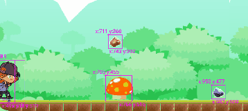
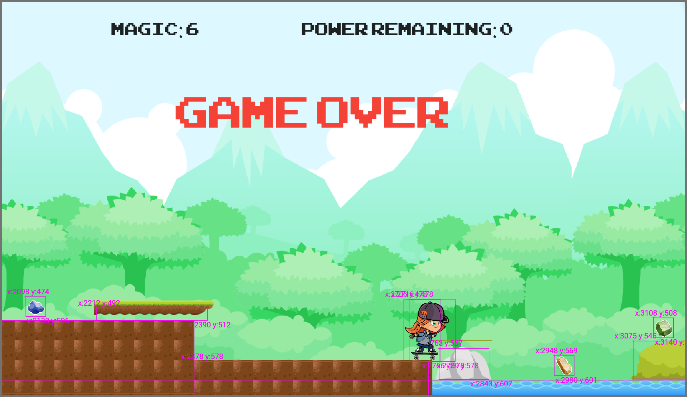
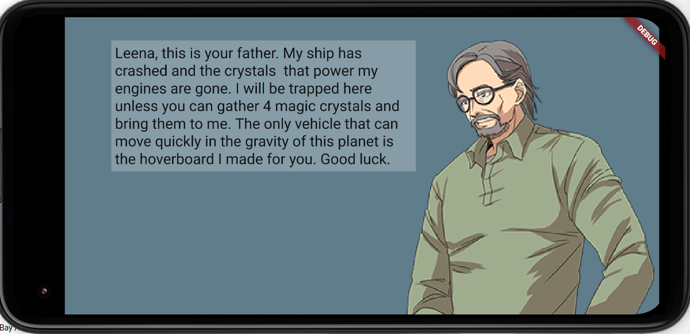

# Leena - Girl Skater

## Game Play

* tap the left and right sides of the screen to move left or right
* tap the top of the screen to jump
* Leena cannot move left or right when she is in the air

## Environment

* Android Pixel 4a API 31
  * At the time of development, the flame_audio for Linux and Windows didn't work.  Use Android
* Flame 1.1.1
* Flutter 2.10.5
* Dart 2.16

## Tutorials

* [Leena - Platformer with Velocity. Flame 1.1.1 26 videos](https://youtube.com/playlist?list=PLxvyAnoL-vu61SszbB5ecb0mV1ppwAIIL)

## Credits

* Leena graphics
  * https://opengameart.org/content/skater-girl-2d-game-character-demo
  * author: overcrafted
  * licenses: [cc-by 4.0](https://creativecommons.org/licenses/by/4.0/), [oga-by 3.0](https://static.opengameart.org/OGA-BY-3.0.txt)
* platform tiles 
  * https://www.gameart2d.com/free-platformer-game-tileset.html
    * GameArt2D
    * [CC0](https://www.gameart2d.com/license.html) - public domain
* Gems: https://cainos.itch.io/pixel-art-icon-pack-rpg
* Audio SFX
  * Yay - https://pixabay.com/sound-effects/yay-6120/
  * Gem bonus - https://mixkit.co/free-sound-effects/game/
* fonts
  * https://www.1001fonts.com/arcade-fonts.html
  